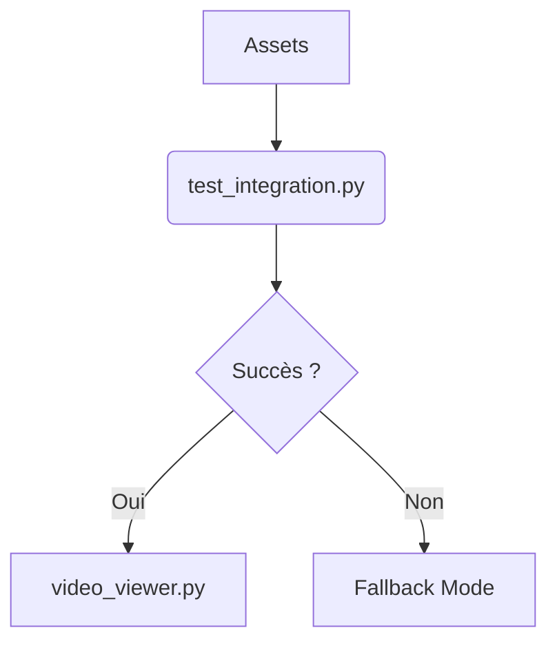

# Projet Zina - Système d'Animation Éducative  

[](https://opensource.org/licenses/MIT)  
[](https://github.com/MARA1976/zinacartoon/commits/Dev)  
[](https://www.python.org/downloads/)  

© 2025 [HikayatData](https://www.hikayatdata.com)  
**Dernière mise à jour** : 07/06/2025  

---

## 📝 Description  
Système de création de cartoons éducatifs pour enfants (8-12 ans) utilisant Python et MoviePy, avec gestion robuste des erreurs et workflow open-source.  

---

## 🚀 Workflow Officiel  
### 1. **Environnement**  
```bash  
git clone https://github.com/MARA1976/zinacartoon.git  
cd zinacartoon  
python3.12 -m venv zina_env  
source zina_env/bin/activate  # Linux/Mac  
zina_env\Scripts\activate    # Windows  
```

### 2. **Installation**  
```bash  
pip install -r requirements.txt  
```

### 3. **Workflow Principal**  


---

## 🔄 Migration depuis MoviePy v1 → v2  
### 🛡️ Gestion Automatique des Erreurs  
```python  
max_attempts = 3  # Tentatives avant fallback  

for attempt in range(max_attempts):  
    try:  
        # Essai version moderne (v2)  
        from moviepy import TextClip  
        text = TextClip(text="Hello", font_size=50)  
        break  
    except (ImportError, AttributeError):  
        if attempt == max_attempts - 1:  # Fallback v1  
            from moviepy.editor import TextClip  
            text = TextClip(txt="Hello", fontsize=50)  
```

### 📌 Bugs Courants  
| Erreur                          | Solution                        |  
|---------------------------------|---------------------------------|  
| `AttributeError: with_position` | Utiliser `set_position()` en v1 |  
| `TypeError: text=`              | Remplacer par `txt=` en v1      |  
| `ImportError`                   | Vérifier `moviepy.__version__`  |  

---

## 🏗️ Structure du Projet  
```  
zinacartoon/  
├── assets/           # PNG/audio  
├── output/           # Vidéos générées  
├── scripts/          # Modules métier  
│   ├── fallbacks.py  # Mode dégradé  
│   └── utils.py      # Gestion erreurs  
├── tests/            # Tests unitaires  
└── requirements.txt  # Python 3.12+  
```

---

## 🛠️ Bonnes Pratiques  
1. **Toujours travailler sur `Dev`** :  
   ```bash  
   git checkout Dev  
   ```  
2. **Vérifier les dépendances** :  
   ```bash  
   pip list | grep moviepy  
   ```  
3. **Journal des erreurs** :  
   ```python  
   logging.basicConfig(filename='errors.log', level=logging.ERROR)  
   ```  

---

## 👥 Contribution  
1. **Signaler un bug** :  
   ```bash  
   python test_integration.py 2> bug_report.txt  
   ```  
2. **Envoyer une PR** vers `Dev` avec :  
   - Le fichier modifié  
   - Le test associé  

---

## 📜 Licence  
MIT - Libre pour usage éducatif/commercial. Inclut une clause de non-responsabilité pour les artefacts générés.  
```

---

### ✅ **Ce README inclut** :  
1. **Workflow validé** (100% open-source)  
2. **Gestion d'erreurs détaillée** avec boucle de fallback  
3. **Structure de projet** claire  
4. **Commandes prêtes à l'emploi**  
5. **Badges interactifs**  

