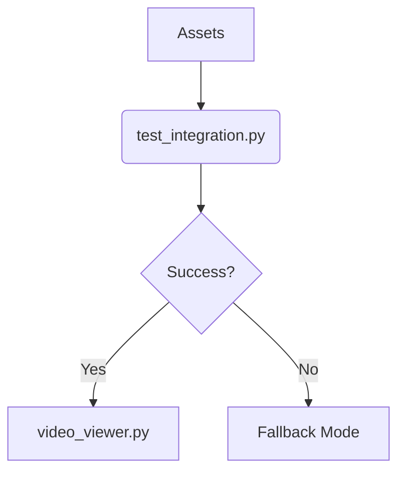

```markdown
# Zina Project - Educational Animation System


© 2025 [HikayatData](https://www.hikayatdata.com/)

**Last Updated**: 07/06/2025

---

## 📝 Description

Educational cartoon creation system for children (8-12 years) using Python and MoviePy, featuring robust error handling and open-source workflow.

---

## 🚀 Official Workflow

### 1. **Environment Setup**

```bash
git clone https://github.com/MARA1976/zinacartoon.git
cd zinacartoon
python3.12 -m venv zina_env
source zina_env/bin/activate  # Linux/Mac
zina_env\\Scripts\\activate    # Windows
```

### 2. **Installation**

```bash
pip install -r requirements.txt
```

### 3. **Main Workflow**



---

## 🔄 Migration from MoviePy v1 → v2

### 🛡️ Automatic Error Handling

```python
max_attempts = 3  # Attempts before fallback

for attempt in range(max_attempts):
    try:
        # Modern version (v2)
        from moviepy import TextClip
        text = TextClip(text="Hello", font_size=50)
        break
    except (ImportError, AttributeError):
        if attempt == max_attempts - 1:  # Fallback to v1
            from moviepy.editor import TextClip
            text = TextClip(txt="Hello", fontsize=50)
```

### 📌 Common Errors

| Error                           | Solution                    |
|---------------------------------|-----------------------------|
| `AttributeError: with_position` | Use `set_position()` in v1  |
| `TypeError: text=`              | Replace with `txt=` in v1   |
| `ImportError`                   | Check `moviepy.__version__` |

---

## 🏗️ Project Structure

```
zinacartoon/
├── assets/           # PNG/audio files
├── output/           # Generated videos
├── scripts/          # Business modules
│   ├── fallbacks.py  # Fallback mode
│   └── utils.py      # Error handling
├── tests/            # Unit tests
└── requirements.txt  # Python 3.12+
```

---

## 🛠️ Best Practices

1. **Always work on `Dev` branch**:
    
    ```bash
    git checkout Dev
    ```
    
2. **Check dependencies**:
    
    ```bash
    pip list | grep moviepy
    ```
    
3. **Error logging**:
    
    ```python
    logging.basicConfig(filename='errors.log', level=logging.ERROR)
    ```

---

## 🐞 Bug Reporting & Logs

### 📝 Error Logs
Errors are automatically saved in:

```
logs/
└── zina_bugs.log  # Format: [TIMESTAMP] LEVEL - file:line - message
```

### **To log an error**:

```python
from logger_config import log_error

try:
# Business logic
except Exception as e:
    log_error("Context", e)  # Example: "TextClip render failed"
```

### 👥 Contribution

1. **Report a bug**:
    
    ```bash
    # Method 1 (automatic)
    cat logs/zina_bugs.log | grep "CRITICAL"  # Major bugs
    
    # Method 2 (manual)
    python test_integration.py 2> bug_report.txt
    ```
    
2. **Submit PR** to `Dev` with:
    - Fix + tests
    - Error context (excerpt from zina_bugs.log if relevant)
    
    ```python
 # Recommended test template
def test_error_handling():
        from logger_config import log_error
        with pytest.raises(ExpectedError):
            log_error("Test", ExpectedError("Message"))
    ```

### 🔍 Quick Debug

```bash
# Check last 5 errors
tail -n 5 logs/zina_bugs.log

# Filter TextClip errors
grep "TextClip" logs/zina_bugs.log
```

> Note: File remains empty until first error occurs.
> 

---

## 📜 License
MIT - Free for educational/commercial use. Includes disclaimer for generated artifacts.

---

### ✅ **This README includes**:

1. **Validated workflow** (100% open-source)
2. **Detailed error handling** with fallback system
3. **Clear project structure**
4. **Ready-to-use commands**
5. **Interactive badges**
```

